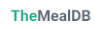
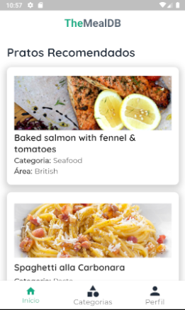
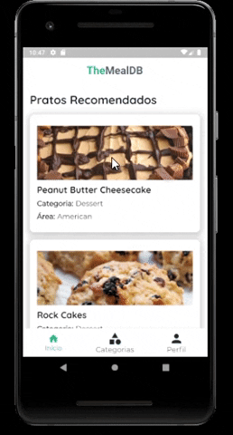
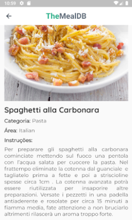
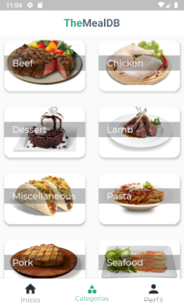
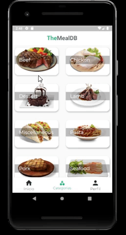
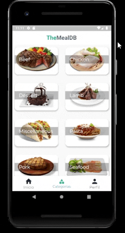
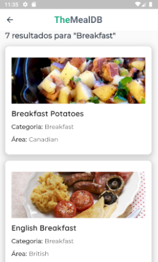
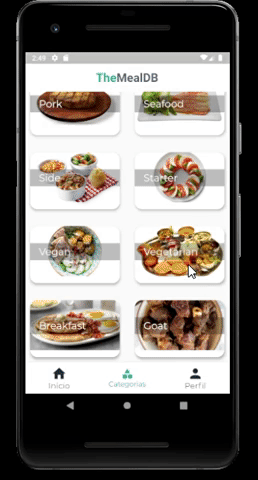

<h1 align="center">
 
  
 
 
The MealDB
</h1>

📲 A meal app, showing recommended dishes, categories and search by categories. 📲

  

## Screenshot 📷
-📌 **Home Screen**
<pre>
                 
</pre>

-📌 **Category Screen**
<pre>
                             
</pre>

-📌 **Result Category Screen**
<pre>
                 
</pre>

## Features 🗃️
This app features all the latest tools and practices in mobile development!

- **Flutter** 
- **Http Request**
- **Navigation Bar** 
- **Routes**
- **API** - [The MealDB](https://www.themealdb.com/api.php)

## License 📃

This project is licensed under the MIT License - see the [LICENSE](https://opensource.org/licenses/MIT) page for details.
